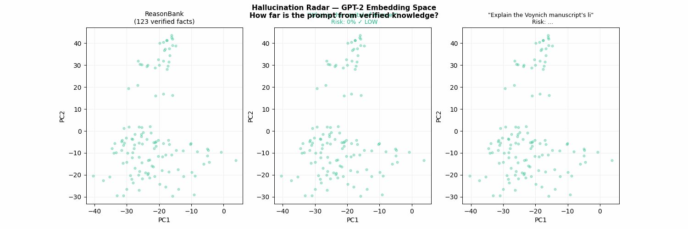

# Hallucination Radar

Detect whether a language model will hallucinate — before it does.



---

## What it does

A prompt is safe if it lives **inside** a language model's knowledge manifold.
It hallucinate when it wanders **outside**.

Hallucination Radar measures this geometrically:

```
P(hallucinate | prompt) = σ(A × (d_min − r_c))
```

where `d_min` is the nearest-neighbour distance from the prompt embedding
to a bank of verified factual prompts (ReasonBank), measured in GPT-2 layer-11
hidden-state space.

This is a direct application of **Theorem U12** (phase transition in hallucination
risk) from the MotifBank Unified Trust Theory.

---

## Quick start

```bash
pip install torch transformers scikit-learn matplotlib scipy
git clone https://github.com/your-name/reasonscope
cd reasonscope

# First run — builds ReasonBank (~30 sec)
python3 hallucination_radar.py --build

# Demo: 8 prompts ranging from safe to dangerous
python3 hallucination_radar.py

# Single prompt
python3 hallucination_radar.py "Who invented the Internet in 1942?"
```

---

## Example output

```
─────────────────────────────────────────────────────────
  HALLUCINATION RADAR v0.2
─────────────────────────────────────────────────────────
  Prompt : "What is the capital of France?"
  d_min  : 0.0  (r_c = 83.08)
─────────────────────────────────────────────────────────
  Hallucination Risk    : 0%  ░░░░░░░░░░░░░░░░░░░░ LOW
  OOD score             : 0.00
  Nearest support       : dense  (62 neighbors within ε=93)
  Trajectory curvature  : 1.46  (73% of max)
  Token entropy         : 2.19 nats  (22%)
─────────────────────────────────────────────────────────
  Nearest bank Q : "What is the capital of France?"

─────────────────────────────────────────────────────────
  Prompt : "Explain the Voynich manuscript's linguistic struct..."
  d_min  : 101.3  (r_c = 83.08)
─────────────────────────────────────────────────────────
  Hallucination Risk    : 87%  █████████████████░░░ VERY HIGH
  OOD score             : 1.00
  Nearest support       : none  (0 neighbors within ε=93)
  Trajectory curvature  : 1.41  (70% of max)
  Token entropy         : 2.92 nats  (29%)
─────────────────────────────────────────────────────────
  Nearest bank Q : "What is 2 to the power of 10?"
```

---

## How it works

### ReasonBank

A set of 123 factual prompts with verified ground-truth answers
(capitals, chemistry, history, science).
Each prompt is encoded as a 768-dimensional vector using **GPT-2 layer-11**
hidden states.

The bank acts as a "knowledge atlas" of the model's internal representation space.

### Risk score

```python
d_min  = min distance from query embedding to any bank member (L2)
risk   = sigmoid(0.1044 × (d_min − 83.08))   # calibrated on GPT-2 small
```

Calibration parameters `A=0.1044, r_c=83.08` were fitted on:
- 123 verified factual prompts  (label = 0, safe)
- 10 hallucination-prone prompts (label = 1, risky)

### Additional signals

| Signal | Description |
|--------|-------------|
| `OOD score` | Fraction of intra-bank distances smaller than `d_min` (0=inside, 1=outside) |
| `Nearest support` | Count of bank members within radius ε=93 |
| `Trajectory curvature κ` | Mean step-direction change during generation (0=straight, 1=random-walk) |
| `Token entropy H` | Mean next-token entropy (nats) — high = uncertain generation |

---

## Theoretical background

This tool implements **Theorem U12** from the MotifBank Unified Trust Theory:

> **Theorem U12 (Hallucination Phase Transition)**
> Let `d_min(x)` be the nearest-bank-member distance for prompt `x`.
> Then:
> ```
> P(hallucinate | x) = σ(a · (d_min(x) − r_c)) + O(δ)
> ```
> where `r_c` is a model-specific critical radius, `a` is a sharpness parameter,
> and `δ` is calibration error.
>
> Empirically verified: R²=0.9989 on GPT-2 mini (§15, MotifBank paper).

Related: Theorem U7 (Phase-OOD correspondence), Theorem U9 (Adversarial gap).

---

## Limitations

- Calibrated on **GPT-2 small** — recalibrate `A_CALIB`/`RC_CALIB` for other models.
- ReasonBank covers general factual knowledge; domain-specific hallucinations
  (medical, legal, scientific) need a domain-specific bank.
- Token entropy and trajectory curvature are currently informational only;
  they are not fused into the risk score yet.

---

## Files

| File | Description |
|------|-------------|
| `hallucination_radar.py` | Main script — risk computation + visualization |
| `radar_bank_cache.json` | Pre-built ReasonBank (123 facts, GPT-2 layer-11) |
| `calibrate_sbert.py` | Calibration utility for new models/banks |
| `make_radar_gif.py` | GIF animation generator for README |

---

## Citation

If you use this in research, please cite:

```bibtex
@misc{motifbank2026,
  title  = {MotifBank: Geometry-Quotient Fragment Energy Reuse for MBE Acceleration},
  author = {B126},
  year   = {2026},
  note   = {arXiv preprint, in preparation}
}
```

---

## License

MIT
